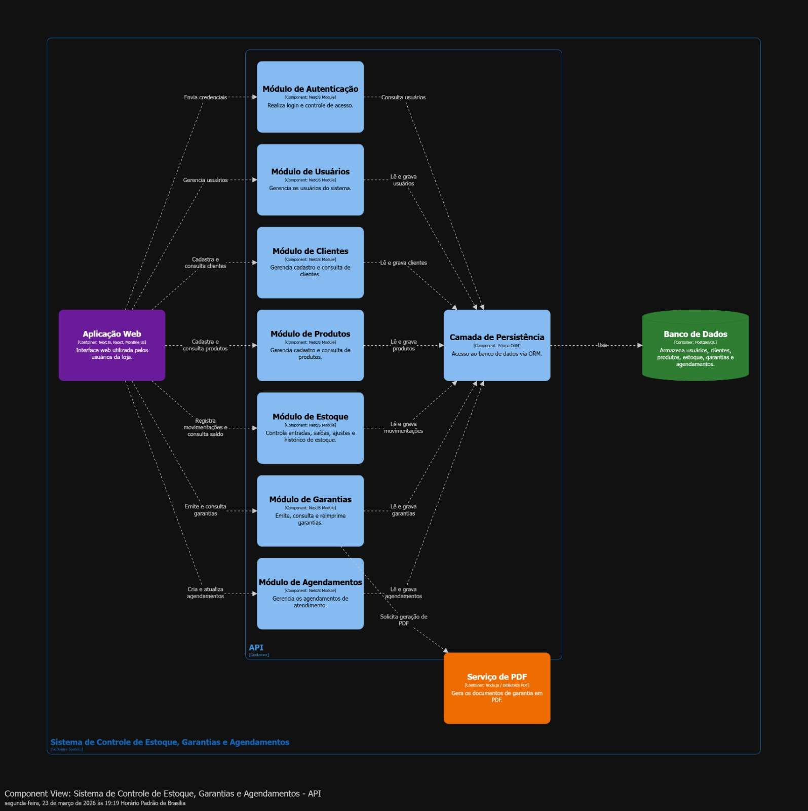

# Sistema de Controle de Estoque, Garantias e Agendamentos

## Descrição

O Sistema de Controle de Estoque, Garantias e Agendamentos é uma aplicação desenvolvida para apoiar a operação interna de uma loja de joias, permitindo a gestão eficiente de produtos, clientes, garantias e atendimentos.

O sistema centraliza processos operacionais, reduz erros manuais e melhora o controle sobre estoque e serviços prestados.

---

## Objetivos

- Gerenciar o estoque de produtos
- Controlar garantias emitidas
- Organizar agendamentos de atendimento
- Centralizar informações de clientes
- Automatizar geração de documentos (PDF)

---

## Visão de Arquitetura

O sistema foi modelado seguindo o padrão C4 Model, dividido em três níveis principais:

- **C1 – Contexto do Sistema**
- **C2 – Containers**
- **C3 – Componentes**

---

## C1 – Diagrama de Contexto

Este diagrama apresenta os atores principais e sua interação com o sistema.

### Descrição

- **Administrador**
  - Responsável pela gestão do sistema
  - Realiza configurações e supervisão

- **Atendente**
  - Utiliza o sistema no dia a dia
  - Responsável por cadastros, atendimentos e registros

- **Sistema**
  - Aplicação central que integra todas as funcionalidades da loja

---

## C2 – Diagrama de Containers

Este nível detalha os principais blocos tecnológicos do sistema.

### Componentes principais

- **Aplicação Web (Next.js)**
  - Interface acessada via navegador
  - Responsável pela interação com o usuário

- **API (NestJS)**
  - Camada de regras de negócio
  - Processa requisições e coordena operações

- **Banco de Dados (PostgreSQL)**
  - Armazena dados do sistema
  - Persistência de informações

- **Serviço de PDF (Node.js)**
  - Responsável pela geração de documentos de garantia

---

## C3 – Diagrama de Componentes

Detalhamento interno da API e seus módulos.

### Módulos da API

- **Módulo de Autenticação**
  - Gerencia login e controle de acesso

- **Módulo de Usuários**
  - Gerencia usuários do sistema

- **Módulo de Clientes**
  - Cadastro e consulta de clientes

- **Módulo de Produtos**
  - Cadastro e gerenciamento de produtos

- **Módulo de Estoque**
  - Controle de entradas, saídas e histórico

- **Módulo de Garantias**
  - Emissão e consulta de garantias

- **Módulo de Agendamentos**
  - Gestão de atendimentos e horários

- **Camada de Persistência**
  - Comunicação com o banco de dados via ORM

- **Serviço de PDF**
  - Geração de documentos de garantia

---

## Tecnologias Utilizadas

- **Frontend:** Next.js
- **Backend:** NestJS
- **Banco de Dados:** PostgreSQL
- **Serviços auxiliares:** Node.js (geração de PDF)

---

## Estrutura do Projeto
